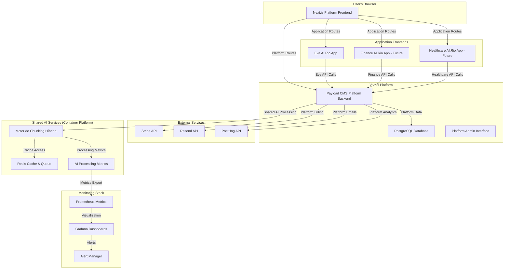

# **AI.Rio Platform Architecture**

## **Introduction**

This document outlines the complete platform architecture for **AI.Rio** - the horizontal AI document processing platform serving multiple industry verticals. It serves as the single source of truth for platform-level technical design and implementation, guiding development teams in building a secure, scalable, and maintainable multi-application platform.

The architecture is designed to support the AI.Rio Platform strategy detailed in the Platform PRD, leveraging a modern, serverless-first stack that enables specialized vertical applications (starting with Eve AI.Rio for legal/LGPD compliance) while maintaining shared platform services and infrastructure.

### **Change Log**

| **Date**   | **Version** | **Description**                                                   | **Author**         |
| ---------- | ----------- | ----------------------------------------------------------------- | ------------------ |
| 2025-01-20 | 1.0         | Platform architecture created from Eve architecture analysis     | John, Product Manager |

## **Platform Strategy & Technical Vision**

### **Platform Architecture Principles**

- **Horizontal Platform with Vertical Specialization**: Shared infrastructure supporting specialized applications
- **Multi-Tenant with Data Isolation**: Platform services with application-specific data separation
- **API-First Design**: Platform APIs separate from application-specific APIs
- **Microservices with Shared Services**: "Motor de Chunking Híbrido" serves all applications
- **Brand-Aware Architecture**: Platform vs application branding and routing

### **Platform Hierarchy**

```
AI.Rio Platform (Master Infrastructure)
├── Platform Services (Shared)
│   ├── User Management & Authentication
│   ├── "Motor de Chunking Híbrido" (Shared AI)
│   ├── Platform Analytics & Monitoring
│   └── Billing & Subscription Management
├── Eve AI.Rio (Legal/LGPD Vertical) - FLAGSHIP
├── Finance AI.Rio (Financial Compliance) - PLANNED
├── Healthcare AI.Rio (Medical Data Protection) - PLANNED
└── Government AI.Rio (Public Sector Compliance) - PLANNED
```

## **High Level Platform Architecture**

### **Technical Summary**

The AI.Rio platform is architected as a **multi-application serverless platform** built on a monorepo structure. The system features a **Next.js** frontend with platform and application-specific routing, and a **Payload CMS** backend that provides platform services and application-specific APIs. The core intellectual property, the proprietary "Motor de Chunking Híbrido", operates as a shared microservice serving all vertical applications with specialized processing rules. This architecture enables independent development of vertical applications while leveraging shared platform infrastructure for security, analytics, user management, and AI processing.

### **Platform and Infrastructure Choice**

- **Primary Platform**: **Vercel** for frontend and platform backend deployment
- **Chunking System Platform**: AWS/GCP/Azure Container Services for the shared AI microservice
- **Database**: PostgreSQL with multi-application data isolation
- **Cache & Queue**: Redis for platform-wide caching and job management
- **Monitoring**: Prometheus + Grafana for platform and application monitoring

**Rationale**: Vercel provides seamless deployment for the platform frontend/backend while container services enable independent scaling of the shared AI system. This hybrid approach optimizes for both platform management simplicity and AI processing performance.

### **Repository Structure**

**Multi-Application Monorepo**: Platform and all applications coexist in a single repository with clear separation:
- Platform-level code in `(platform)` routes and shared services
- Application-specific code in dedicated route groups (`(eve-app)`, etc.)
- Shared components and utilities available to all applications
- Application-scoped data models with platform-level collections

### **High Level Platform Architecture Diagram**



### **Platform Architectural Patterns**

- **Multi-Tenant Platform**: Shared platform services with application-specific data isolation
- **API Gateway Pattern**: Platform backend orchestrates application-specific processing
- **Shared Services Architecture**: Common AI, analytics, and platform services
- **Event-Driven Processing**: Async document processing with cross-application analytics
- **Circuit Breaker Pattern**: Resilient communication between platform and shared services
- **Brand-Aware Routing**: Platform vs application routing with consistent branding

## **Platform Tech Stack**

This section defines the complete technology stack for the AI.Rio platform supporting multiple applications.

### **Platform Technology Stack**

| **Category** | **Technology** | **Version** | **Platform Purpose** | **Rationale** |
|--------------|---------------|-------------|---------------------|---------------|
| **Frontend Language** | TypeScript | ~5.x | Platform and application development | Type safety across platform boundaries |
| **Frontend Framework** | Next.js | ~14.x | Platform and application routing | Server-side rendering with multi-app support |
| **UI Component Library** | shadcn/ui | Latest | Shared component system | Consistent UI across platform and applications |
| **Styling** | Tailwind CSS | ~3.x | Platform design system | Brand-aware styling for platform and apps |
| **State Management** | Zustand | ~4.x | Platform and application state | Lightweight state management across contexts |
| **Backend Language** | TypeScript | ~5.x | Platform services and APIs | End-to-end type safety across platform |
| **Backend Framework** | Payload CMS | ~3.x | Platform backend and application APIs | Multi-tenant support with data isolation |
| **API Style** | REST & GraphQL | N/A | Platform and application APIs | Flexible API patterns for different use cases |
| **Database** | PostgreSQL | ~16.x | Platform data with application isolation | ACID compliance with multi-tenant support |
| **Cache & Queue** | Redis | ~7.x | Platform-wide caching and job management | High-performance shared services |
| **File Storage** | Vercel Blob Storage | Latest | Platform document storage with isolation | Secure multi-application file management |
| **Authentication** | Payload CMS Auth | ~3.x | Platform user management | Multi-application access control |
| **Shared AI Service** | Python FastAPI | 3.11+ | Motor de Chunking Híbrido | High-performance shared AI processing |
| **Monitoring** | Prometheus + Grafana | Latest | Platform and application monitoring | Enterprise-grade observability |
| **Analytics** | PostHog | Latest | Platform and application analytics | Unified analytics across applications |
| **Payments** | Stripe | Latest | Platform subscription management | Multi-application billing support |
| **Email** | Resend + React Email | Latest | Platform transactional emails | Consistent email experience |

## **Platform Data Models**

### **Platform-Level Collections**

#### **Applications Collection**
**Purpose**: Manages metadata and configuration for all platform applications

```typescript
interface Application {
  id: string
  name: string // 'eve', 'finance', 'healthcare', 'government'
  displayName: string // 'Eve AI.Rio', 'Finance AI.Rio', etc.
  status: 'active' | 'development' | 'deprecated' | 'planned'
  branding: {
    primaryColor: string
    secondaryColor: string
    logo: string
    description: string
    marketingTagline: string
  }
  routes: string[] // Application-specific route patterns
  permissions: string[] // Available permission levels
  subscriptionTiers: string[] // Available subscription tiers
  apiEndpoints: {
    documents: string
    analysis: string
    reports: string
  }
  chunkingRules: {
    documentTypes: string[]
    processingStrategy: string
    specializations: string[]
  }
  createdAt: Date
  updatedAt: Date
}
```

#### **Enhanced Users Collection**
**Purpose**: Platform user management with multi-application access control

```typescript
interface User {
  id: string
  email: string
  name: string
  
  // Platform-level properties
  platformRole: 'platform_admin' | 'user'
  platformStatus: 'active' | 'suspended' | 'pending'
  
  // Multi-application access
  applicationAccess: {
    applicationId: string
    role: 'admin' | 'user' | 'viewer'
    subscriptionTier: string
    status: 'active' | 'suspended'
    grantedAt: Date
    permissions: string[]
  }[]
  
  // Platform preferences
  preferences: {
    language: 'pt-BR' | 'en'
    timezone: string
    notifications: {
      email: boolean
      platform: boolean
      applications: Record<string, boolean>
    }
  }
  
  // Platform metadata
  lastLoginAt: Date
  createdAt: Date
  updatedAt: Date
}
```

#### **Platform Subscriptions Collection**
**Purpose**: Multi-application subscription and billing management

```typescript
interface PlatformSubscription {
  id: string
  userId: string
  
  // Platform-level subscription
  platformTier: 'starter' | 'professional' | 'enterprise'
  platformStatus: 'active' | 'cancelled' | 'suspended'
  
  // Application-specific subscriptions
  applicationSubscriptions: {
    applicationId: string
    tier: string
    features: string[]
    usage: {
      documentsProcessed: number
      monthlyLimit: number
      currentPeriodStart: Date
      currentPeriodEnd: Date
    }
    billing: {
      amount: number
      currency: 'BRL' | 'USD'
      interval: 'monthly' | 'yearly'
    }
  }[]
  
  // Stripe integration
  stripeCustomerId: string
  stripeSubscriptionId: string
  
  // Platform billing
  billingAddress: {
    country: string
    state: string
    city: string
    postalCode: string
    line1: string
    line2?: string
  }
  
  createdAt: Date
  updatedAt: Date
}
```

#### **Platform Analytics Collection**
**Purpose**: Cross-application analytics and business intelligence

```typescript
interface PlatformAnalytics {
  id: string
  
  // Event metadata
  eventType: 'user_action' | 'system_event' | 'business_metric'
  applicationId?: string // null for platform-level events
  userId?: string
  sessionId?: string
  
  // Event data
  event: string // 'document_uploaded', 'analysis_completed', etc.
  properties: Record<string, any>
  
  // Platform context
  platform: {
    version: string
    environment: 'development' | 'staging' | 'production'
    region: string
  }
  
  // Device/Browser context (for frontend events)
  device?: {
    userAgent: string
    ip: string
    country: string
    city: string
  }
  
  timestamp: Date
}
```

### **Application-Scoped Collections**

#### **Enhanced Documents Collection**
**Purpose**: Document metadata with application isolation and platform integration

```typescript
interface Document {
  id: string
  userId: string
  applicationId: string // Scope to specific application
  
  // Document metadata
  filename: string
  fileSize: number
  mimeType: string
  storageUrl: string
  checksumSHA256: string
  
  // Processing status
  processingStatus: 'pending' | 'processing' | 'completed' | 'failed'
  chunkingSystemJobId?: string
  
  // Application-specific data
  applicationSpecificData: {
    // Eve AI.Rio: LGPD-specific metadata
    documentType?: 'contract' | 'privacy_policy' | 'data_agreement'
    jurisdiction?: string
    legalEntity?: string
    complianceFramework?: 'LGPD' | 'GDPR' | 'CCPA'
    
    // Finance AI.Rio: Financial regulation metadata
    financialInstrument?: string
    regulatoryFramework?: string
    riskCategory?: string
    
    // Healthcare AI.Rio: Medical compliance metadata
    patientDataLevel?: string
    hipaaClassification?: string
    medicalSpecialty?: string
  }
  
  // Platform integration
  platformMetadata: {
    uploadSource: 'web' | 'api' | 'batch'
    processingRegion: string
    dataResidencyRequirement: string
    auditLevel: 'standard' | 'enhanced'
  }
  
  createdAt: Date
  updatedAt: Date
}
```

#### **Enhanced AnalysisReports Collection**
**Purpose**: Analysis results with application specialization and platform analytics

```typescript
interface AnalysisReport {
  id: string
  documentId: string
  applicationId: string
  userId: string
  
  // Universal analysis results
  overallRiskScore: number // 0-100
  processingTimeMs: number
  
  // Application-specific results
  applicationSpecificResults: {
    // Eve AI.Rio: LGPD-specific analysis
    riskLevel?: 'baixo' | 'médio' | 'alto'
    identifiedRisks?: {
      id: string
      category: string
      description: string
      severity: 'baixa' | 'média' | 'alta'
      lgpdArticles: string[]
      recommendations: string[]
      textReferences: {
        startChar: number
        endChar: number
        context: string
      }[]
    }[]
    
    // Finance AI.Rio: Financial compliance analysis
    complianceGaps?: string[]
    regulatoryRequirements?: string[]
    riskAssessment?: Record<string, any>
    
    // Healthcare AI.Rio: Medical compliance analysis
    phiIdentified?: boolean
    hipaaCompliance?: Record<string, any>
    medicalRisks?: string[]
  }
  
  // Platform processing metadata
  chunkingMetadata: {
    chunksGenerated: number
    processingStrategy: string
    qualityScore: number
    semanticCoherence: number
    applicationSpecialization: string
  }
  
  // Platform analytics
  qualityMetrics: {
    accuracyScore?: number
    confidenceLevel: number
    processingEfficiency: number
    userSatisfactionScore?: number
  }
  
  generatedAt: Date
}
```

## **Platform Routing Architecture**

### **Multi-Application Route Structure**

```
src/app/
├── (platform)/                    # AI.Rio Platform Routes
│   ├── layout.tsx                 # Platform master brand layout
│   ├── page.tsx                   # Platform homepage (ai.rio)
│   ├── plataforma/                # Platform overview and capabilities
│   │   └── page.tsx
│   ├── aplicacoes/                # Application marketplace
│   │   ├── page.tsx               # Applications grid
│   │   ├── eve/                   # Eve AI.Rio marketing section
│   │   │   ├── page.tsx
│   │   │   └── demonstracao/
│   │   ├── finance/               # Finance AI.Rio marketing (future)
│   │   │   └── page.tsx
│   │   └── healthcare/            # Healthcare AI.Rio marketing (future)
│   │       └── page.tsx
│   ├── precos/                    # Platform pricing
│   │   └── page.tsx
│   ├── blog/                      # Platform blog
│   │   ├── page.tsx
│   │   └── [slug]/
│   │       └── page.tsx
│   ├── sobre/                     # About AI.Rio platform
│   │   └── page.tsx
│   └── contato/                   # Platform contact
│       └── page.tsx
├── (eve-app)/                     # Eve AI.Rio Application Routes
│   ├── layout.tsx                 # Eve application layout (forest green theme)
│   ├── dashboard/                 # Eve dashboard
│   │   └── page.tsx
│   ├── upload/                    # Document upload
│   │   └── page.tsx
│   ├── reports/                   # LGPD reports
│   │   └── [id]/
│   │       └── page.tsx
│   └── settings/                  # Eve-specific settings
│       └── page.tsx
├── (finance-app)/                 # Finance AI.Rio Application Routes (future)
│   ├── layout.tsx
│   ├── dashboard/
│   └── analysis/
├── (healthcare-app)/              # Healthcare AI.Rio Application Routes (future)
│   ├── layout.tsx
│   ├── dashboard/
│   └── compliance/
├── (platform-admin)/              # Platform Administration Routes
│   ├── layout.tsx                 # Platform admin layout
│   ├── users/                     # Multi-application user management
│   │   └── page.tsx
│   ├── applications/              # Application lifecycle management
│   │   ├── page.tsx
│   │   └── [id]/
│   │       └── page.tsx
│   ├── analytics/                 # Cross-application analytics
│   │   └── page.tsx
│   ├── billing/                   # Platform subscription management
│   │   └── page.tsx
│   └── system/                    # Platform health monitoring
│       └── page.tsx
└── (payload)/                     # Backend API Routes
    ├── admin/                     # Payload admin interface
    └── api/                       # API endpoints
        ├── platform/              # Platform-level APIs
        │   ├── users/
        │   ├── applications/
        │   ├── analytics/
        │   └── billing/
        ├── eve/                   # Eve application APIs
        │   ├── documents/
        │   ├── analysis/
        │   └── reports/
        ├── finance/               # Finance application APIs (future)
        └── healthcare/            # Healthcare application APIs (future)
```

### **Platform vs Application Layouts**

#### **Platform Layout** (`src/app/(platform)/layout.tsx`)
```typescript
export default function PlatformLayout({
  children,
}: {
  children: React.ReactNode
}) {
  return (
    <div className="platform-layout">
      <PlatformHeader 
        logo="ai.rio-quantum-orbital"
        tagline="Harnessing Complexity. Powering Progress."
        colors={{
          primary: "#00d4ff",
          secondary: "#10b981", 
          accent: "#6366f1"
        }}
      />
      <PlatformNavigation 
        applications={['eve', 'finance', 'healthcare']}
        currentPath={pathname}
      />
      <main className="platform-content">
        {children}
      </main>
      <PlatformFooter />
    </div>
  )
}
```

#### **Eve Application Layout** (`src/app/(eve-app)/layout.tsx`)
```typescript
export default function EveLayout({
  children,
}: {
  children: React.ReactNode
}) {
  return (
    <div className="eve-application-layout">
      <EveHeader 
        logo="eve-by-ai-rio"
        colors={{
          primary: "#1A472A",
          secondary: "#B4884B",
          accent: "#F8F7F4"
        }}
        platformBreadcrumb={{
          platform: "AI.Rio",
          application: "Eve AI.Rio"
        }}
      />
      <EveNavigation 
        applicationRoutes={[
          'dashboard',
          'upload', 
          'reports',
          'settings'
        ]}
      />
      <main className="eve-application-content">
        {children}
      </main>
      <EveFooter />
    </div>
  )
}
```

## **Platform API Architecture**

### **API Route Structure and Separation**

#### **Platform-Level APIs** (`/api/platform/`)

```typescript
// Platform User Management
GET    /api/platform/users              # List platform users
POST   /api/platform/users              # Create platform user
PUT    /api/platform/users/{id}         # Update user
GET    /api/platform/users/{id}/access  # Get application access
POST   /api/platform/users/{id}/access  # Grant application access

// Application Management
GET    /api/platform/applications       # List all applications
POST   /api/platform/applications       # Create new application
PUT    /api/platform/applications/{id}  # Update application config
GET    /api/platform/applications/{id}/health # Application health

// Cross-Application Analytics
GET    /api/platform/analytics/overview      # Platform-wide metrics
GET    /api/platform/analytics/applications  # Per-application metrics
GET    /api/platform/analytics/users         # User behavior across apps
POST   /api/platform/analytics/events        # Record platform events

// Platform Billing & Subscriptions
GET    /api/platform/billing/subscriptions   # Platform subscriptions
POST   /api/platform/billing/subscriptions   # Create subscription
PUT    /api/platform/billing/subscriptions/{id} # Update subscription
GET    /api/platform/billing/usage           # Usage across applications
```

#### **Application-Specific APIs** (`/api/{application}/`)

```typescript
// Eve AI.Rio APIs (/api/eve/)
POST   /api/eve/documents/upload         # Upload legal document
GET    /api/eve/documents               # List user's documents  
POST   /api/eve/documents/{id}/analyze  # Trigger LGPD analysis
GET    /api/eve/documents/{id}/analysis # Get LGPD analysis results
GET    /api/eve/reports/{id}            # Get formatted LGPD report
POST   /api/eve/reports/{id}/export     # Export report (PDF/text)

// Finance AI.Rio APIs (/api/finance/) - Future
POST   /api/finance/documents/upload    # Upload financial document
POST   /api/finance/documents/{id}/analyze # Trigger financial analysis
GET    /api/finance/compliance/{id}     # Get compliance assessment

// Healthcare AI.Rio APIs (/api/healthcare/) - Future
POST   /api/healthcare/documents/upload # Upload medical document
POST   /api/healthcare/documents/{id}/analyze # Trigger HIPAA analysis
GET    /api/healthcare/phi/{id}         # Get PHI analysis results
```

### **Shared Services Integration**

#### **Motor de Chunking Híbrido Integration**

```typescript
// Shared chunking service interface
interface ChunkingRequest {
  documentId: string
  applicationId: string
  processingRules: {
    // Application-specific processing rules
    eve: {
      focusAreas: ['data_processing', 'consent', 'rights']
      regulatoryFramework: 'LGPD'
      language: 'pt-BR'
    }
    finance: {
      focusAreas: ['risk_assessment', 'compliance', 'reporting']
      regulatoryFramework: 'BACEN'
      language: 'pt-BR'
    }
    healthcare: {
      focusAreas: ['phi_detection', 'consent', 'data_security']
      regulatoryFramework: 'HIPAA'
      language: 'en'
    }
  }
  priority: 'low' | 'normal' | 'high'
  callbackUrl: string
}

// Platform chunking service client
class PlatformChunkingService {
  async analyzeDocument(request: ChunkingRequest): Promise<string> {
    // Add platform context
    const platformRequest = {
      ...request,
      platformMetadata: {
        requestId: generateCorrelationId(),
        timestamp: new Date(),
        region: process.env.PLATFORM_REGION,
        version: process.env.PLATFORM_VERSION
      }
    }
    
    // Send to shared chunking system
    const response = await this.chunkingClient.post('/analyze', platformRequest)
    
    // Track platform-level metrics
    await this.analyticsService.trackEvent({
      event: 'chunking_request_submitted',
      applicationId: request.applicationId,
      properties: {
        documentType: request.processingRules[request.applicationId],
        priority: request.priority
      }
    })
    
    return response.data.jobId
  }
}
```

## **Platform Brand Identity & Design System**

### **Master Brand Implementation**

#### **Visual Identity Standards**

```typescript
// Platform brand constants
export const PlatformBrand = {
  logo: {
    primary: "ai.rio-quantum-orbital", // Animated quantum orbital
    wordmark: "ai.rio",
    animation: "orbital-rotation-3s-infinite"
  },
  typography: {
    primary: "Sansation", // Body text
    secondary: "Lora",    // Headings
    mono: "JetBrains Mono" // Code
  },
  colors: {
    platform: {
      primary: "#00d4ff",    // AI.Rio blue
      secondary: "#10b981",  // Platform green  
      accent: "#6366f1",     // Enterprise purple
      neutral: {
        50: "#f8fafc",
        100: "#f1f5f9",
        500: "#64748b",
        900: "#0f172a"
      }
    },
    applications: {
      eve: {
        primary: "#1A472A",   // Forest green
        secondary: "#B4884B", // Legal gold
        accent: "#F8F7F4"     // Document white
      },
      finance: {
        primary: "#1e40af",   // Finance blue
        secondary: "#059669", // Growth green
        accent: "#fbbf24"     // Gold accent
      },
      healthcare: {
        primary: "#dc2626",   // Medical red
        secondary: "#2563eb", // Trust blue
        accent: "#f3f4f6"     // Clean white
      }
    }
  },
  spacing: {
    platform: "8px base grid",
    components: "4px micro-adjustments"
  },
  borderRadius: {
    platform: "8px",
    components: "4px", 
    cards: "12px"
  }
}

// Application brand extensions
export const ApplicationBrands = {
  eve: {
    ...PlatformBrand,
    colors: PlatformBrand.colors.applications.eve,
    messaging: {
      tagline: "Conformidade LGPD Inteligente",
      value: "Análise jurídica automatizada para compliance"
    }
  },
  finance: {
    ...PlatformBrand,
    colors: PlatformBrand.colors.applications.finance,
    messaging: {
      tagline: "Inteligência Regulatória Financeira",
      value: "Compliance automatizado para instituições financeiras"
    }
  }
}
```

#### **Component Design System**

```typescript
// Platform components with brand awareness
export const PlatformComponents = {
  // Master brand header for platform pages
  PlatformHeader: ({ 
    logo = "quantum-orbital",
    tagline = "Harnessing Complexity. Powering Progress.",
    navigation = true 
  }) => (
    <header className="platform-header bg-platform-primary">
      <div className="container mx-auto px-4">
        <div className="flex items-center justify-between h-16">
          <div className="flex items-center space-x-4">
            <QuantumOrbitalLogo className="h-8 w-auto" />
            <div className="hidden md:block">
              <h1 className="font-lora text-xl font-bold text-white">
                AI.Rio
              </h1>
              <p className="font-sansation text-sm text-blue-100">
                {tagline}
              </p>
            </div>
          </div>
          {navigation && <PlatformNavigation />}
        </div>
      </div>
    </header>
  ),

  // Application headers with platform context
  ApplicationHeader: ({ 
    application,
    colors,
    showPlatformBreadcrumb = true 
  }) => (
    <header className={`application-header bg-${application}-primary`}>
      {showPlatformBreadcrumb && (
        <div className="platform-breadcrumb bg-gray-50 border-b">
          <div className="container mx-auto px-4 py-2">
            <nav className="flex items-center space-x-2 text-sm">
              <Link href="/" className="text-platform-primary hover:underline">
                AI.Rio Platform
              </Link>
              <ChevronRightIcon className="h-4 w-4 text-gray-400" />
              <span className="text-gray-600">
                {ApplicationBrands[application].messaging.tagline}
              </span>
            </nav>
          </div>
        </div>
      )}
      {/* Application-specific header content */}
    </header>
  )
}
```

## **Platform Security & Compliance**

### **Multi-Application Security Architecture**

#### **Authentication & Authorization**

```typescript
// Platform-aware authentication
interface PlatformAuthContext {
  user: User
  platformPermissions: string[]
  applicationAccess: {
    [applicationId: string]: {
      role: string
      permissions: string[]
      subscriptionTier: string
    }
  }
  currentApplication?: string
}

// Platform authentication middleware
export function platformAuthMiddleware(req: Request, res: Response, next: NextFunction) {
  const token = extractToken(req)
  const user = validateToken(token)
  
  // Build platform context
  const authContext: PlatformAuthContext = {
    user,
    platformPermissions: getUserPlatformPermissions(user),
    applicationAccess: getUserApplicationAccess(user),
    currentApplication: extractApplicationFromPath(req.path)
  }
  
  req.platformAuth = authContext
  next()
}

// Application access control
export function requireApplicationAccess(applicationId: string) {
  return (req: Request, res: Response, next: NextFunction) => {
    const { platformAuth } = req
    
    if (!platformAuth.applicationAccess[applicationId]) {
      return res.status(403).json({
        error: 'Application access denied',
        applicationId,
        availableApplications: Object.keys(platformAuth.applicationAccess)
      })
    }
    
    next()
  }
}
```

#### **Data Isolation Strategy**

```typescript
// Application-scoped data access
class PlatformDataService {
  // Ensure all queries are application-scoped
  async getDocuments(userId: string, applicationId: string) {
    return await db.documents.findMany({
      where: {
        userId,
        applicationId, // Critical: Application isolation
      }
    })
  }
  
  // Platform-level queries for admin functions
  async getPlatformAnalytics(adminUserId: string) {
    // Verify platform admin role
    await this.verifyPlatformAdmin(adminUserId)
    
    return await db.platformAnalytics.findMany({
      where: {
        eventType: 'business_metric'
      }
    })
  }
  
  // Cross-application queries with proper access control
  async getCrossApplicationData(userId: string, requestedApplications: string[]) {
    const userAccess = await this.getUserApplicationAccess(userId)
    const allowedApplications = requestedApplications.filter(app => 
      userAccess.includes(app)
    )
    
    return await db.documents.findMany({
      where: {
        userId,
        applicationId: { in: allowedApplications }
      }
    })
  }
}
```

### **Platform Compliance Framework**

#### **LGPD Compliance (Platform-Wide)**

- **Data Residency**: All data stored in Brazilian data centers
- **Cross-Border Transfers**: Controlled transfers with adequate protections
- **Data Subject Rights**: Platform-wide rights management across applications
- **Consent Management**: Application-specific consent with platform oversight
- **Audit Trails**: Comprehensive logging across platform and applications

#### **SOC2 Type II (Platform Certification)**

- **Security**: Platform-wide security controls and monitoring
- **Availability**: 99.9% uptime SLA across all applications
- **Processing Integrity**: Data integrity across platform and applications
- **Confidentiality**: Application-specific data isolation
- **Privacy**: Comprehensive privacy controls and user rights

## **Platform Monitoring & Observability**

### **Multi-Application Monitoring Stack**

#### **Metrics Collection Architecture**

```typescript
// Platform metrics service
class PlatformMetricsService {
  async collectApplicationMetrics(applicationId: string) {
    return {
      // Application-specific metrics
      activeUsers: await this.getActiveUsers(applicationId),
      documentsProcessed: await this.getDocumentsProcessed(applicationId),
      analysisSuccessRate: await this.getAnalysisSuccessRate(applicationId),
      averageProcessingTime: await this.getAverageProcessingTime(applicationId),
      
      // Platform integration metrics
      chunkingSystemUsage: await this.getChunkingSystemUsage(applicationId),
      apiResponseTimes: await this.getApiResponseTimes(applicationId),
      errorRates: await this.getErrorRates(applicationId)
    }
  }
  
  async collectPlatformMetrics() {
    return {
      // Platform-wide metrics
      totalUsers: await this.getTotalUsers(),
      totalApplications: await this.getActiveApplications(),
      crossApplicationUsage: await this.getCrossApplicationUsage(),
      platformRevenue: await this.getPlatformRevenue(),
      
      // Infrastructure metrics
      systemUptime: await this.getSystemUptime(),
      databasePerformance: await this.getDatabasePerformance(),
      chunkingSystemHealth: await this.getChunkingSystemHealth()
    }
  }
}
```

#### **Alerting Strategy**

```yaml
# Platform-wide alerts
platform_alerts:
  critical:
    - platform_down: "Platform unavailable"
    - chunking_system_down: "Shared AI system unavailable"
    - database_connection_lost: "Database connectivity issues"
    - security_breach: "Security incident detected"
  
  warning:
    - high_error_rate: "Error rate >5% across applications"
    - slow_response_times: "API response times >2s"
    - approaching_rate_limits: "Rate limits at 80% capacity"

# Application-specific alerts  
application_alerts:
  eve:
    critical:
      - lgpd_analysis_failure: "LGPD analysis system down"
      - document_upload_failure: "Document upload system unavailable"
    warning:
      - slow_analysis_times: "LGPD analysis >90s"
      - high_false_positive_rate: "Analysis accuracy declining"
  
  finance:
    critical:
      - compliance_check_failure: "Financial compliance system down"
    warning:
      - regulatory_update_needed: "New regulations require system update"
```

## **Platform Deployment & Infrastructure**

### **Multi-Environment Strategy**

| **Environment** | **Platform URL** | **Eve URL** | **Finance URL** | **Purpose** |
|-----------------|------------------|-------------|-----------------|-------------|
| Development | localhost:3000 | localhost:3000/eve | localhost:3000/finance | Local development |
| Staging | staging.ai.rio | staging.ai.rio/eve | staging.ai.rio/finance | Pre-production testing |
| Production | ai.rio | ai.rio/eve | ai.rio/finance | Live platform |

### **Platform CI/CD Pipeline**

```yaml
name: AI.Rio Platform CI/CD

on:
  push:
    branches: [main, staging, develop]
  pull_request:
    branches: [main]

jobs:
  platform-tests:
    runs-on: ubuntu-latest
    steps:
      - uses: actions/checkout@v4
      - name: Setup Node.js
        uses: actions/setup-node@v4
        with:
          node-version: '18'
      
      - name: Install dependencies
        run: npm ci
      
      - name: Run platform tests
        run: |
          npm run test:platform
          npm run test:eve
          npm run test:integration
      
      - name: Platform security scan
        run: npm audit --audit-level high
      
      - name: Deploy to staging
        if: github.ref == 'refs/heads/staging'
        run: |
          vercel deploy --token=${{ secrets.VERCEL_TOKEN }}
          
  chunking-system-tests:
    runs-on: ubuntu-latest
    steps:
      - name: Test chunking system integration
        run: |
          python -m pytest chunking-system/tests/
          python -m pytest tests/integration/chunking/
```

### **Infrastructure as Code**

```yaml
# Platform infrastructure definition
apiVersion: v1
kind: ConfigMap
metadata:
  name: platform-config
data:
  PLATFORM_NAME: "AI.Rio"
  PLATFORM_TAGLINE: "Harnessing Complexity. Powering Progress."
  SUPPORTED_APPLICATIONS: "eve,finance,healthcare,government"
  
  # Eve application config
  EVE_DISPLAY_NAME: "Eve AI.Rio"
  EVE_BRAND_COLORS: "#1A472A,#B4884B,#F8F7F4"
  EVE_REGULATORY_FOCUS: "LGPD"
  
  # Chunking system config
  CHUNKING_SYSTEM_URL: "https://chunking-api.ai.rio"
  CHUNKING_SYSTEM_TIMEOUT: "30000"
  CHUNKING_SYSTEM_RETRY_COUNT: "3"
  
  # Platform analytics
  POSTHOG_API_KEY: "${POSTHOG_API_KEY}"
  PLATFORM_ANALYTICS_ENABLED: "true"
```

## **Future Platform Expansion**

### **New Application Integration Framework**

#### **Application Onboarding Process**

1. **Application Definition**: Define new application in Applications collection
2. **Route Structure**: Create `(application-app)` route group
3. **API Endpoints**: Implement `/api/application/` endpoints  
4. **Data Models**: Extend application-scoped collections
5. **Chunking Rules**: Configure application-specific processing rules
6. **Brand Integration**: Implement application brand within platform framework
7. **Testing**: Comprehensive testing with platform integration
8. **Deployment**: Gradual rollout with platform monitoring

#### **Planned Applications Roadmap**

**Finance AI.Rio** (Q2 2025):
- Central Bank of Brazil (BACEN) compliance
- Financial risk assessment and reporting
- Integration with financial data sources
- Real-time regulatory monitoring

**Healthcare AI.Rio** (Q3 2025):
- HIPAA compliance for Brazilian healthcare
- Medical record privacy analysis  
- Integration with healthcare information systems
- PHI detection and protection

**Government AI.Rio** (Q4 2025):
- Public sector document processing
- Transparency and accountability compliance
- Integration with government systems
- Multi-level government support

---

**This Platform Architecture establishes AI.Rio as a comprehensive, scalable platform capable of supporting multiple specialized applications while maintaining security, performance, and brand consistency across all touchpoints.**