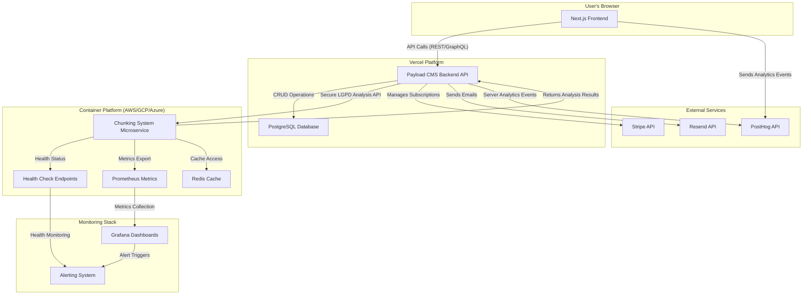
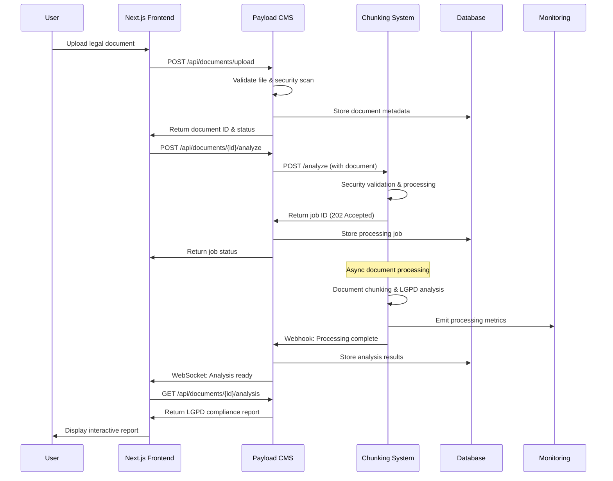
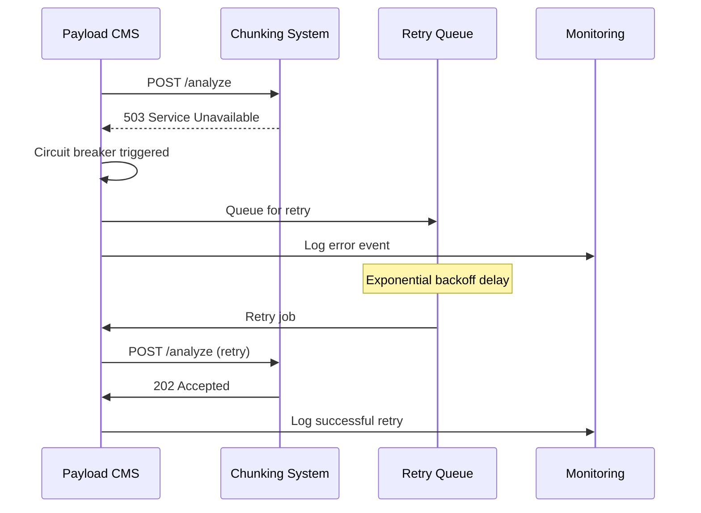
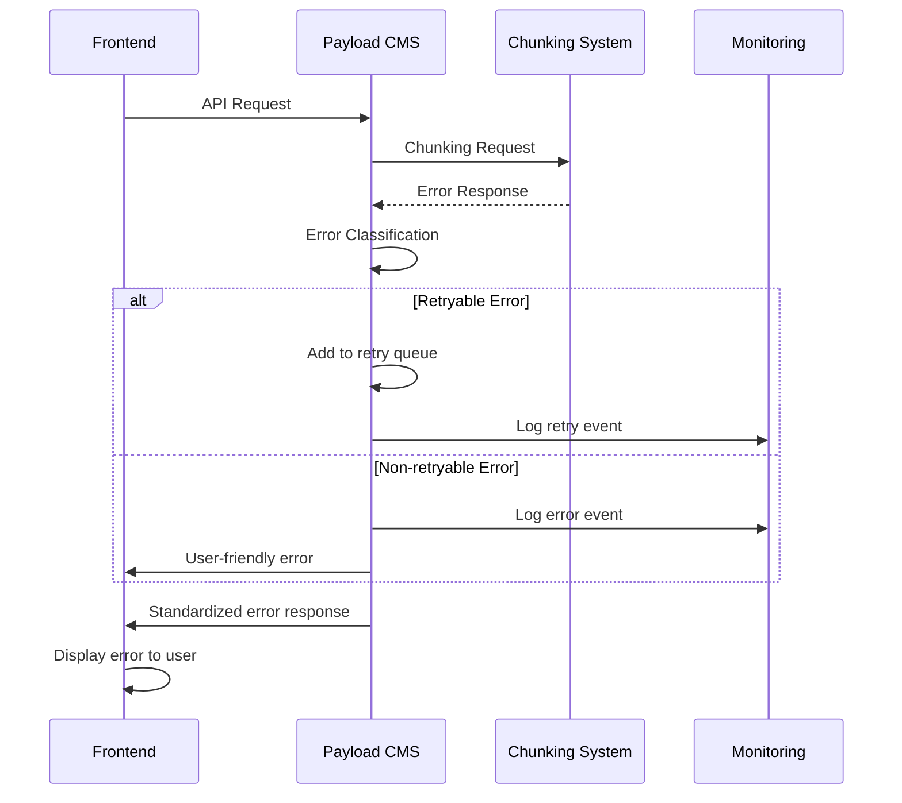

# **Eve AI.Rio - Chunking System Integration Architecture**

## **Introduction**

This document outlines the comprehensive fullstack architecture for integrating the Eve AI.Rio LGPD Compliance Specialist platform with the enterprise-ready document chunking system. It serves as the single source of truth for the integration design, covering secure communication patterns, data flow, security considerations, error handling, monitoring, performance optimization, and deployment strategies.

The integration combines the power of Eve AI.Rio's Next.js + Payload CMS platform with the advanced document processing capabilities of the chunking system microservice to deliver high-accuracy LGPD compliance analysis at enterprise scale.

### **Starter Template or Existing Project**

This integration architecture is based on:
- **Eve AI.Rio Platform**: Existing Next.js + Payload CMS monorepo deployed on Vercel
- **Chunking System**: Standalone enterprise-ready Python microservice with comprehensive monitoring and security features
- **Integration Pattern**: Microservices architecture with secure API communication between services

### **Change Log**

| Date | Version | Description | Author |
|------|---------|-------------|---------|
| 2025-07-18 | 1.0 | Initial integration architecture document | Claude |

## **High Level Architecture**

### **Technical Summary**

The Eve AI.Rio + Chunking System integration follows a secure microservices architecture pattern where the Next.js frontend communicates with the Payload CMS backend, which in turn securely communicates with the chunking system microservice for LGPD document analysis. The chunking system operates as an isolated, enterprise-ready service with comprehensive monitoring, security hardening, and performance optimization capabilities. Communication between services uses secure REST APIs with proper authentication, rate limiting, and comprehensive error handling. The entire architecture prioritizes LGPD compliance, data security, and enterprise-grade observability.

### **Platform and Infrastructure Choice**

**Primary Platform:** Vercel (for Eve AI.Rio)
**Chunking System Platform:** AWS/GCP/Azure Container Services or Kubernetes
**Key Services:** 
- Vercel (Next.js frontend & Payload CMS backend)
- PostgreSQL (Vercel Postgres or external managed database)
- Container platform for chunking system
- Redis for caching and rate limiting
- Prometheus + Grafana for monitoring
**Deployment Host and Regions:** Multi-region deployment with primary in Brazil for LGPD compliance

### **Repository Structure**

**Structure:** Multi-repository approach with clear service boundaries
**Integration Strategy:** API-first communication between repositories
**Shared Components:** TypeScript interfaces for API contracts, shared monitoring configurations

### **High Level Architecture Diagram**



### **Architectural Patterns**

- **Microservices Architecture:** Eve AI.Rio and chunking system operate as independent services with clear API boundaries
- **API Gateway Pattern:** Payload CMS acts as API gateway for frontend requests and orchestrates chunking system communication
- **Circuit Breaker Pattern:** Resilient communication with fallback mechanisms for chunking system failures
- **Event-Driven Processing:** Asynchronous document processing with status tracking and webhook notifications
- **CQRS Pattern:** Separate read/write operations for document analysis workflows
- **Security-First Design:** End-to-end encryption, LGPD compliance, and comprehensive audit trails

## **Tech Stack**

This section defines the complete technology stack for the Eve AI.Rio + Chunking System integration.

### **Technology Stack Table**

| Category | Technology | Version | Purpose | Rationale |
|----------|------------|---------|---------|-----------|
| **Frontend Language** | TypeScript | ~5.x | Type-safe frontend development | Ensures type safety across integration APIs |
| **Frontend Framework** | Next.js | ~14.x | React-based web application | Server-side rendering and API routes for chunking integration |
| **UI Component Library** | shadcn/ui | Latest | Consistent UI components | Rapid development of analysis result interfaces |
| **State Management** | Zustand | ~4.x | Client-side state management | Managing document upload and analysis states |
| **Backend Language** | TypeScript | ~5.x | Type-safe backend API development | Consistent types across frontend/backend boundary |
| **Backend Framework** | Payload CMS | ~3.x | Headless CMS and API framework | Built-in auth, data models, and REST/GraphQL APIs |
| **API Style** | REST & GraphQL | N/A | Flexible API access patterns | REST for chunking integration, GraphQL for frontend |
| **Database** | PostgreSQL | ~16.x | Primary data persistence | ACID compliance for audit trails and analysis results |
| **Cache** | Redis | ~7.x | High-performance caching and rate limiting | Session storage and chunking system response caching |
| **File Storage** | Vercel Blob Storage | Latest | Secure document storage | LGPD-compliant file storage with encryption |
| **Authentication** | Payload CMS Auth | ~3.x | User authentication and authorization | Role-based access control for LGPD compliance |
| **Chunking Service Language** | Python | 3.11+ | Document processing microservice | Advanced NLP libraries and enterprise monitoring |
| **Chunking Framework** | FastAPI/Flask | Latest | REST API for chunking service | High-performance async API with OpenAPI documentation |
| **Message Queue** | Redis Pub/Sub | ~7.x | Async processing coordination | Document processing status updates |
| **Monitoring** | Prometheus + Grafana | Latest | Comprehensive system monitoring | Enterprise-grade observability and alerting |
| **Logging** | Structured JSON | N/A | Centralized logging with correlation IDs | Distributed tracing across service boundaries |
| **Testing** | Jest + Playwright + pytest | Latest | Full-stack testing coverage | Unit, integration, and E2E testing across services |
| **CI/CD** | GitHub Actions + Docker | N/A | Automated testing and deployment | Multi-service deployment orchestration |
| **Security Scanning** | Snyk + Bandit | Latest | Automated vulnerability detection | LGPD compliance and security hardening |

## **Data Models**

### **Core Integration Data Models**

The following data models support the Eve AI.Rio + Chunking System integration:

#### **Documents Collection (Enhanced)**

**Purpose:** Stores metadata and processing status for legal documents uploaded for LGPD analysis

**Key Attributes:**
- `id`: string - Unique document identifier
- `filename`: string - Original document filename
- `fileSize`: number - File size in bytes
- `mimeType`: string - Document MIME type (PDF, DOCX)
- `uploadedBy`: User - Reference to user who uploaded
- `uploadedAt`: Date - Upload timestamp
- `processingStatus`: enum - "pending" | "processing" | "completed" | "failed" | "retrying"
- `chunkingSystemJobId`: string - Reference to chunking system job
- `securityCheckStatus`: enum - "pending" | "passed" | "failed"
- `lgpdComplianceFlags`: object - LGPD-specific metadata flags

**TypeScript Interface (Payload CMS Collection):**
```typescript
// Payload Collection Config
import type { CollectionConfig } from 'payload'

export const Documents: CollectionConfig = {
  slug: 'documents',
  fields: [
    {
      name: 'filename',
      type: 'text',
      required: true,
    },
    {
      name: 'file',
      type: 'upload',
      relationTo: 'media',
      required: true,
    },
    {
      name: 'fileSize',
      type: 'number',
      required: true,
    },
    {
      name: 'mimeType',
      type: 'text',
      required: true,
    },
    {
      name: 'uploadedBy',
      type: 'relationship',
      relationTo: 'users',
      required: true,
    },
    {
      name: 'processingStatus',
      type: 'select',
      options: ['pending', 'processing', 'completed', 'failed', 'retrying'],
      defaultValue: 'pending',
    },
    {
      name: 'chunkingSystemJobId',
      type: 'text',
    },
    {
      name: 'securityCheckStatus',
      type: 'select',
      options: ['pending', 'passed', 'failed'],
      defaultValue: 'pending',
    },
    {
      name: 'storageUrl',
      type: 'text',
      required: true,
    },
    {
      name: 'checksumSHA256',
      type: 'text',
      required: true,
    },
    {
      name: 'lgpdComplianceFlags',
      type: 'group',
      fields: [
        {
          name: 'containsPersonalData',
          type: 'checkbox',
          defaultValue: false,
        },
        {
          name: 'dataSensitivityLevel',
          type: 'select',
          options: ['low', 'medium', 'high'],
        },
        {
          name: 'processingLegalBasis',
          type: 'array',
          fields: [
            {
              name: 'basis',
              type: 'text',
            },
          ],
        },
        {
          name: 'retentionPeriod',
          type: 'number',
        },
      ],
    },
  ],
  hooks: {
    afterChange: [
      // Import and use the afterChange hook here
      // afterChangeHook
    ],
  },
}

// Generated TypeScript interface
interface Document {
  id: string;
  filename: string;
  file: string | Media; // Payload upload relationship
  fileSize: number;
  mimeType: string;
  uploadedBy: string | User; // Payload relationship
  processingStatus: ProcessingStatus;
  chunkingSystemJobId?: string;
  securityCheckStatus: SecurityStatus;
  storageUrl: string;
  checksumSHA256: string;
  lgpdComplianceFlags: LGPDComplianceFlags;
  createdAt: Date;
  updatedAt: Date;
}

type ProcessingStatus = "pending" | "processing" | "completed" | "failed" | "retrying";
type SecurityStatus = "pending" | "passed" | "failed";

interface LGPDComplianceFlags {
  containsPersonalData: boolean;
  dataSensitivityLevel: "low" | "medium" | "high";
  processingLegalBasis: Array<{ basis: string }>;
  retentionPeriod?: number;
}
```

**Relationships:**
- Belongs to one User
- Has one AnalysisReport
- Has many ProcessingLogs

#### **AnalysisReports Collection (Enhanced)**

**Purpose:** Stores structured LGPD compliance analysis results from the chunking system

**Key Attributes:**
- `id`: string - Unique report identifier
- `documentId`: string - Reference to analyzed document
- `overallRiskScore`: number - Aggregate LGPD compliance risk score (0-100)
- `riskLevel`: enum - "baixo" | "médio" | "alto"
- `identifiedRisks`: array - Detailed risk findings
- `chunkingMetadata`: object - Processing metadata from chunking system
- `generatedAt`: Date - Analysis completion timestamp
- `processingTimeMs`: number - Total processing time
- `qualityMetrics`: object - Chunk quality and analysis metrics

**Payload Collection Config:**
```typescript
export const AnalysisReports: CollectionConfig = {
  slug: 'analysis-reports',
  fields: [
    {
      name: 'document',
      type: 'relationship',
      relationTo: 'documents',
      required: true,
    },
    {
      name: 'overallRiskScore',
      type: 'number',
      min: 0,
      max: 100,
      required: true,
    },
    {
      name: 'riskLevel',
      type: 'select',
      options: ['baixo', 'médio', 'alto'],
      required: true,
    },
    {
      name: 'identifiedRisks',
      type: 'array',
      fields: [
        {
          name: 'category',
          type: 'text',
          required: true,
        },
        {
          name: 'description',
          type: 'textarea',
          required: true,
        },
        {
          name: 'severity',
          type: 'select',
          options: ['baixa', 'média', 'alta'],
          required: true,
        },
        {
          name: 'lgpdArticles',
          type: 'array',
          fields: [
            {
              name: 'article',
              type: 'text',
            },
          ],
        },
        {
          name: 'recommendations',
          type: 'array',
          fields: [
            {
              name: 'recommendation',
              type: 'textarea',
            },
          ],
        },
        {
          name: 'chunkReferences',
          type: 'array',
          fields: [
            {
              name: 'chunkId',
              type: 'text',
            },
            {
              name: 'startIndex',
              type: 'number',
            },
            {
              name: 'endIndex',
              type: 'number',
            },
          ],
        },
      ],
    },
    {
      name: 'chunkingMetadata',
      type: 'group',
      fields: [
        {
          name: 'chunksGenerated',
          type: 'number',
        },
        {
          name: 'processingStrategy',
          type: 'text',
        },
        {
          name: 'qualityScore',
          type: 'number',
          min: 0,
          max: 100,
        },
        {
          name: 'semanticCoherence',
          type: 'number',
          min: 0,
          max: 1,
        },
        {
          name: 'structurePreservation',
          type: 'number',
          min: 0,
          max: 1,
        },
      ],
    },
    {
      name: 'generatedAt',
      type: 'date',
      defaultValue: () => new Date(),
    },
    {
      name: 'processingTimeMs',
      type: 'number',
    },
    {
      name: 'qualityMetrics',
      type: 'json',
    },
  ],
}

// Generated TypeScript interfaces
interface AnalysisReport {
  id: string;
  document: string | Document;
  overallRiskScore: number;
  riskLevel: "baixo" | "médio" | "alto";
  identifiedRisks: LGPDRisk[];
  chunkingMetadata: ChunkingMetadata;
  generatedAt: Date;
  processingTimeMs: number;
  qualityMetrics: QualityMetrics;
  createdAt: Date;
  updatedAt: Date;
}

interface LGPDRisk {
  category: string;
  description: string;
  severity: "baixa" | "média" | "alta";
  lgpdArticles: Array<{ article: string }>;
  recommendations: Array<{ recommendation: string }>;
  chunkReferences: ChunkReference[];
}

interface ChunkReference {
  chunkId: string;
  startIndex: number;
  endIndex: number;
}

interface ChunkingMetadata {
  chunksGenerated: number;
  processingStrategy: string;
  qualityScore: number;
  semanticCoherence: number;
  structurePreservation: number;
}
```

**Relationships:**
- Belongs to one Document
- Belongs to one User (through Document)
- Has many AuditEntries

#### **ProcessingJobs Collection (New)**

**Purpose:** Tracks document processing jobs across the distributed system

**Key Attributes:**
- `id`: string - Unique job identifier
- `documentId`: string - Reference to document being processed
- `chunkingSystemJobId`: string - External job reference
- `status`: enum - Job processing status
- `startedAt`: Date - Job start timestamp
- `completedAt`: Date - Job completion timestamp
- `errorDetails`: object - Error information if failed
- `retryCount`: number - Number of retry attempts
- `processingMetrics`: object - Performance and quality metrics

**Payload Collection Config:**
```typescript
export const ProcessingJobs: CollectionConfig = {
  slug: 'processing-jobs',
  fields: [
    {
      name: 'document',
      type: 'relationship',
      relationTo: 'documents',
      required: true,
    },
    {
      name: 'chunkingSystemJobId',
      type: 'text',
      unique: true,
    },
    {
      name: 'status',
      type: 'select',
      options: ['queued', 'processing', 'completed', 'failed', 'cancelled'],
      defaultValue: 'queued',
    },
    {
      name: 'startedAt',
      type: 'date',
    },
    {
      name: 'completedAt',
      type: 'date',
    },
    {
      name: 'errorDetails',
      type: 'group',
      fields: [
        {
          name: 'errorCode',
          type: 'text',
        },
        {
          name: 'message',
          type: 'textarea',
        },
        {
          name: 'stackTrace',
          type: 'textarea',
        },
        {
          name: 'retryable',
          type: 'checkbox',
          defaultValue: false,
        },
      ],
    },
    {
      name: 'retryCount',
      type: 'number',
      defaultValue: 0,
    },
    {
      name: 'processingMetrics',
      type: 'group',
      fields: [
        {
          name: 'processingTimeMs',
          type: 'number',
        },
        {
          name: 'peakMemoryUsage',
          type: 'number',
        },
        {
          name: 'chunksGenerated',
          type: 'number',
        },
        {
          name: 'qualityScore',
          type: 'number',
          min: 0,
          max: 100,
        },
      ],
    },
    {
      name: 'webhookEvents',
      type: 'array',
      fields: [
        {
          name: 'event',
          type: 'text',
        },
        {
          name: 'timestamp',
          type: 'date',
        },
        {
          name: 'data',
          type: 'json',
        },
      ],
    },
  ],
}

// Generated TypeScript interfaces
interface ProcessingJob {
  id: string;
  document: string | Document;
  chunkingSystemJobId: string;
  status: JobStatus;
  startedAt: Date;
  completedAt?: Date;
  errorDetails?: ProcessingError;
  retryCount: number;
  processingMetrics: ProcessingMetrics;
  webhookEvents: WebhookEvent[];
  createdAt: Date;
  updatedAt: Date;
}

type JobStatus = "queued" | "processing" | "completed" | "failed" | "cancelled";

interface ProcessingError {
  errorCode: string;
  message: string;
  stackTrace?: string;
  retryable: boolean;
}

interface ProcessingMetrics {
  processingTimeMs: number;
  peakMemoryUsage: number;
  chunksGenerated: number;
  qualityScore: number;
}

interface WebhookEvent {
  event: string;
  timestamp: Date;
  data: any;
}
```

## **API Specification**

### **Payload CMS API Integration**

Payload CMS provides built-in REST and GraphQL APIs. The integration leverages these APIs along with custom endpoints:

**Built-in Payload APIs:**
- `GET /api/documents` - List documents with filtering
- `POST /api/documents` - Create new document (with file upload)
- `GET /api/documents/:id` - Get specific document
- `PATCH /api/documents/:id` - Update document
- `DELETE /api/documents/:id` - Delete document

**Custom Integration Endpoints:**

```yaml
openapi: 3.0.0
info:
  title: Eve AI.Rio - Chunking System Integration API
  version: 1.0.0
  description: Secure API for LGPD document analysis integration
servers:
  - url: https://eve-ai-rio.com/api
    description: Production API
  - url: https://staging.eve-ai-rio.com/api
    description: Staging API

paths:
  /chunking-webhook:
    post:
      summary: Webhook endpoint for chunking system callbacks
      security:
        - ApiKeyAuth: []
      requestBody:
        content:
          application/json:
            schema:
              type: object
              properties:
                jobId:
                  type: string
                  description: Chunking system job ID
                status:
                  type: string
                  enum: [completed, failed]
                results:
                  type: object
                  description: Analysis results from chunking system
                error:
                  type: object
                  description: Error details if status is failed
      responses:
        '200':
          description: Webhook processed successfully
        '400':
          description: Invalid webhook payload
        '401':
          description: Unauthorized

  /analysis/{documentId}/retry:
    post:
      summary: Retry failed LGPD analysis
      security:
        - BearerAuth: []
      parameters:
        - name: documentId
          in: path
          required: true
          schema:
            type: string
      responses:
        '202':
          description: Analysis retry initiated
        '404':
          description: Document not found
        '409':
          description: Analysis already in progress

  /system/health:
    get:
      summary: Check system health including chunking system
      security:
        - BearerAuth: []
      responses:
        '200':
          description: System healthy
          content:
            application/json:
              schema:
                $ref: '#/components/schemas/HealthStatus'

components:
  securitySchemes:
    BearerAuth:
      type: http
      scheme: bearer
      bearerFormat: JWT
      description: Payload CMS JWT authentication
    ApiKeyAuth:
      type: apiKey
      in: header
      name: X-API-Key
      description: Chunking system webhook authentication

  schemas:
    WebhookPayload:
      type: object
      properties:
        jobId:
          type: string
        status:
          type: string
          enum: [completed, failed]
        results:
          $ref: '#/components/schemas/AnalysisResults'
        error:
          $ref: '#/components/schemas/ProcessingError'
      required: [jobId, status]

    AnalysisResults:
      type: object
      properties:
        overallRiskScore:
          type: integer
          minimum: 0
          maximum: 100
        riskLevel:
          type: string
          enum: [baixo, médio, alto]
        identifiedRisks:
          type: array
          items:
            $ref: '#/components/schemas/LGPDRisk'
        chunkingMetadata:
          $ref: '#/components/schemas/ChunkingMetadata'
        processingMetrics:
          $ref: '#/components/schemas/ProcessingMetrics'

    ProcessingError:
      type: object
      properties:
        errorCode:
          type: string
        message:
          type: string
        retryable:
          type: boolean

    ChunkingMetadata:
      type: object
      properties:
        chunksGenerated:
          type: integer
        processingStrategy:
          type: string
        qualityScore:
          type: number
          minimum: 0
          maximum: 100
        semanticCoherence:
          type: number
          minimum: 0
          maximum: 1
        structurePreservation:
          type: number
          minimum: 0
          maximum: 1

    LGPDRisk:
      type: object
      properties:
        id:
          type: string
        category:
          type: string
        description:
          type: string
        severity:
          type: string
          enum: [baixa, média, alta]
        lgpdArticles:
          type: array
          items:
            type: string
        recommendations:
          type: array
          items:
            type: string

    ProcessingMetrics:
      type: object
      properties:
        processingTimeMs:
          type: integer
        chunksGenerated:
          type: integer
        qualityScore:
          type: number
          minimum: 0
          maximum: 100
        semanticCoherence:
          type: number
          minimum: 0
          maximum: 1

    HealthStatus:
      type: object
      properties:
        status:
          type: string
          enum: [healthy, degraded, unhealthy]
        timestamp:
          type: string
          format: date-time
        components:
          type: object
        uptime:
          type: number
```

## **Server Functions Integration**

### **Payload Local API Server Functions**

Server functions provide secure bridge between frontend and Payload Local API for chunking system integration:

```typescript
'use server'

import { getPayload } from 'payload'
import config from '@payload-config'

export async function uploadAndAnalyzeDocument(formData: FormData) {
  const payload = await getPayload({ config })
  
  try {
    // Create document record
    const document = await payload.create({
      collection: 'documents',
      data: {
        filename: formData.get('filename') as string,
        fileSize: parseInt(formData.get('fileSize') as string),
        mimeType: formData.get('mimeType') as string,
        // File will be handled by Payload's upload field
      },
      file: formData.get('file') as File,
    })
    
    // afterChange hook will automatically trigger chunking system
    return { success: true, documentId: document.id }
  } catch (error) {
    throw new Error(`Error uploading document: ${error.message}`)
  }
}

export async function getAnalysisStatus(documentId: string) {
  const payload = await getPayload({ config })
  
  try {
    const document = await payload.findByID({
      collection: 'documents',
      id: documentId,
    })
    
    const processingJob = await payload.find({
      collection: 'processing-jobs',
      where: {
        documentId: {
          equals: documentId,
        },
      },
      limit: 1,
    })
    
    return {
      processingStatus: document.processingStatus,
      jobStatus: processingJob.docs[0]?.status,
      estimatedCompletion: processingJob.docs[0]?.estimatedCompletion,
    }
  } catch (error) {
    throw new Error(`Error fetching analysis status: ${error.message}`)
  }
}

export async function getAnalysisReport(documentId: string) {
  const payload = await getPayload({ config })
  
  try {
    const report = await payload.find({
      collection: 'analysis-reports',
      where: {
        documentId: {
          equals: documentId,
        },
      },
      limit: 1,
    })
    
    if (!report.docs.length) {
      return { error: 'Analysis not yet completed' }
    }
    
    return report.docs[0]
  } catch (error) {
    throw new Error(`Error fetching analysis report: ${error.message}`)
  }
}

export async function retryFailedAnalysis(documentId: string) {
  const payload = await getPayload({ config })
  
  try {
    // Update document status to trigger re-analysis
    await payload.update({
      collection: 'documents',
      id: documentId,
      data: {
        processingStatus: 'pending',
      },
    })
    
    // Reset processing job
    const existingJob = await payload.find({
      collection: 'processing-jobs',
      where: {
        documentId: { equals: documentId },
      },
      limit: 1,
    })
    
    if (existingJob.docs.length) {
      await payload.update({
        collection: 'processing-jobs',
        id: existingJob.docs[0].id,
        data: {
          status: 'queued',
          retryCount: existingJob.docs[0].retryCount + 1,
          errorDetails: null,
        },
      })
    }
    
    return { success: true, message: 'Analysis retry initiated' }
  } catch (error) {
    throw new Error(`Error retrying analysis: ${error.message}`)
  }
}
```

### **Frontend Server Function Usage**

```typescript
'use client'

import React, { useState } from 'react'
import { uploadAndAnalyzeDocument, getAnalysisStatus, getAnalysisReport } from '../server/actions'

export const DocumentAnalysisFlow: React.FC = () => {
  const [uploadStatus, setUploadStatus] = useState<string>('')
  const [analysisStatus, setAnalysisStatus] = useState<string>('')
  
  const handleFileUpload = async (file: File) => {
    const formData = new FormData()
    formData.append('file', file)
    formData.append('filename', file.name)
    formData.append('fileSize', file.size.toString())
    formData.append('mimeType', file.type)
    
    try {
      const result = await uploadAndAnalyzeDocument(formData)
      setUploadStatus(`Document uploaded: ${result.documentId}`)
      
      // Poll for analysis completion
      pollAnalysisStatus(result.documentId)
    } catch (error) {
      setUploadStatus(`Upload failed: ${error.message}`)
    }
  }
  
  const pollAnalysisStatus = async (documentId: string) => {
    const interval = setInterval(async () => {
      try {
        const status = await getAnalysisStatus(documentId)
        setAnalysisStatus(`Status: ${status.processingStatus}`)
        
        if (status.processingStatus === 'completed') {
          clearInterval(interval)
          const report = await getAnalysisReport(documentId)
          // Handle completed analysis
        }
      } catch (error) {
        clearInterval(interval)
        setAnalysisStatus(`Error: ${error.message}`)
      }
    }, 2000)
  }
  
  return (
    <div>
      <input
        type="file"
        accept=".pdf,.docx"
        onChange={(e) => e.target.files?.[0] && handleFileUpload(e.target.files[0])}
      />
      <p>{uploadStatus}</p>
      <p>{analysisStatus}</p>
    </div>
  )
}
```

## **Components**

### **Frontend Components (Next.js)**

#### **Document Upload Component**
- **Responsibility:** Secure document upload with progress tracking and validation
- **Key Interfaces:** 
  - File upload with drag-and-drop
  - Real-time upload progress
  - Security validation feedback
- **Dependencies:** Payload CMS API, file validation utilities
- **Technology Stack:** Next.js, TypeScript, shadcn/ui components

#### **Analysis Dashboard Component**
- **Responsibility:** Real-time monitoring of document analysis status
- **Key Interfaces:**
  - Job status tracking
  - Progress indicators
  - Error handling and retry controls
- **Dependencies:** WebSocket/polling for real-time updates
- **Technology Stack:** React hooks, Zustand state management

#### **LGPD Report Viewer Component**
- **Responsibility:** Interactive display of LGPD compliance analysis results
- **Key Interfaces:**
  - Three-panel layout (document, risks, recommendations)
  - Risk highlighting and navigation
  - Export functionality
- **Dependencies:** Analysis report API, PDF export service
- **Technology Stack:** React components, PDF.js integration

### **Backend Components (Payload CMS)**

#### **Document Processing Service**
- **Responsibility:** Orchestrates document upload, validation, and chunking system integration
- **Key Interfaces:**
  - Document upload endpoint
  - Chunking system API client
  - Status tracking and webhook handling
- **Dependencies:** File storage, chunking system API, audit logging
- **Technology Stack:** TypeScript, Payload CMS collections and hooks

**Hook Implementation Example:**
```typescript
import type { CollectionAfterChangeHook } from 'payload'
import { ChunkingSystemClient } from '../integrations/chunking-system'

const afterChange: CollectionAfterChangeHook = async ({ req, doc, operation }) => {
  // Only trigger for new documents
  if (operation === 'create') {
    try {
      // Create processing job using req for transaction support
      const processingJob = await req.payload.create({
        req, // Pass req object for transaction support
        collection: 'processing-jobs',
        data: {
          documentId: doc.id,
          status: 'queued',
          startedAt: new Date(),
          retryCount: 0,
        },
      })

      // Trigger chunking system analysis
      const chunkingClient = new ChunkingSystemClient()
      const analysisJob = await chunkingClient.analyzeDocument({
        documentId: doc.id,
        documentUrl: doc.storageUrl,
        processingJobId: processingJob.id,
      })

      // Update processing job with chunking system job ID
      await req.payload.update({
        req,
        collection: 'processing-jobs',
        id: processingJob.id,
        data: {
          chunkingSystemJobId: analysisJob.jobId,
          status: 'processing',
        },
      })

      // Update document with processing status
      await req.payload.update({
        req,
        collection: 'documents',
        id: doc.id,
        data: {
          processingStatus: 'processing',
          chunkingSystemJobId: analysisJob.jobId,
        },
      })

    } catch (error) {
      // Log error and update status
      req.payload.logger.error('Failed to trigger document analysis', { error, documentId: doc.id })
      
      await req.payload.update({
        req,
        collection: 'documents',
        id: doc.id,
        data: {
          processingStatus: 'failed',
        },
      })
    }
  }
}

export default afterChange
```

#### **Integration API Gateway**
- **Responsibility:** Secure communication layer with the chunking system
- **Key Interfaces:**
  - Authentication and authorization
  - Rate limiting and circuit breaker
  - Request/response transformation
- **Dependencies:** Redis for rate limiting, monitoring service
- **Technology Stack:** Node.js, HTTP client libraries, middleware

#### **Audit and Compliance Service**
- **Responsibility:** LGPD compliance tracking and audit trail management
- **Key Interfaces:**
  - Audit event logging
  - Compliance reporting
  - Data retention management
- **Dependencies:** PostgreSQL audit tables, encryption service
- **Technology Stack:** Payload CMS hooks, database triggers

### **Chunking System Components (Microservice)**

#### **API Gateway Component**
- **Responsibility:** External API interface for document processing requests
- **Key Interfaces:**
  - REST API endpoints (/analyze, /status, /health)
  - Authentication and rate limiting
  - Request validation and sanitization
- **Dependencies:** Redis cache, monitoring system
- **Technology Stack:** FastAPI/Flask, Python, middleware components

#### **Document Processing Engine**
- **Responsibility:** Core LGPD-focused document analysis and chunking
- **Key Interfaces:**
  - Multi-format document processing
  - Hybrid chunking strategies
  - Quality evaluation and optimization
- **Dependencies:** NLP libraries, LLM providers, storage system
- **Technology Stack:** Python, LangChain, scikit-learn, custom algorithms

#### **Monitoring and Observability**
- **Responsibility:** Comprehensive system monitoring and health reporting
- **Key Interfaces:**
  - Prometheus metrics export
  - Health check endpoints
  - Distributed tracing
- **Dependencies:** Prometheus, Grafana, logging infrastructure
- **Technology Stack:** Python monitoring libraries, structured logging

## **External APIs**

### **Chunking System API**

- **Purpose:** Primary integration point for LGPD document analysis
- **Documentation:** Internal API specification (OpenAPI 3.0)
- **Base URL(s):** https://chunking-api.internal.com/v1
- **Authentication:** Mutual TLS with API key
- **Rate Limits:** 100 requests/minute per API key

**Key Endpoints Used:**
- `POST /analyze` - Submit document for LGPD analysis
- `GET /jobs/{jobId}/status` - Check analysis job status
- `GET /jobs/{jobId}/results` - Retrieve analysis results
- `GET /health` - Service health check

**Integration Notes:** 
- Async processing with webhook callbacks
- Comprehensive error handling and retry logic
- Circuit breaker pattern for resilience

### **Monitoring and Alerting APIs**

- **Purpose:** External monitoring integration for enterprise observability
- **Documentation:** Prometheus API, Grafana API
- **Base URL(s):** Internal monitoring infrastructure
- **Authentication:** Service accounts with monitoring permissions
- **Rate Limits:** Standard monitoring tool limits

## **Core Workflows**

### **LGPD Document Analysis Workflow**



### **Error Handling and Retry Workflow**



## **Database Schema**

### **PostgreSQL Schema for Integration**

```sql
-- Enhanced Documents table (Payload CMS conventions)
CREATE TABLE documents (
    id UUID PRIMARY KEY DEFAULT gen_random_uuid(),
    filename VARCHAR(255) NOT NULL,
    "fileSize" BIGINT NOT NULL,
    "mimeType" VARCHAR(100) NOT NULL,
    "uploadedBy" UUID REFERENCES users(id),
    "uploadedAt" TIMESTAMPTZ DEFAULT NOW(),
    "processingStatus" VARCHAR(20) DEFAULT 'pending',
    "chunkingSystemJobId" VARCHAR(255),
    "securityCheckStatus" VARCHAR(20) DEFAULT 'pending',
    "storageUrl" TEXT NOT NULL,
    "checksumSHA256" VARCHAR(64) NOT NULL,
    "lgpdComplianceFlags" JSONB DEFAULT '{}',
    "createdAt" TIMESTAMPTZ DEFAULT NOW(),
    "updatedAt" TIMESTAMPTZ DEFAULT NOW(),
    -- Payload CMS system fields
    "_status" VARCHAR(32) DEFAULT 'published'
);

-- Analysis Reports table (Payload CMS conventions)
CREATE TABLE "analysis-reports" (
    id UUID PRIMARY KEY DEFAULT gen_random_uuid(),
    "documentId" UUID REFERENCES documents(id),
    "overallRiskScore" INTEGER CHECK ("overallRiskScore" >= 0 AND "overallRiskScore" <= 100),
    "riskLevel" VARCHAR(10) CHECK ("riskLevel" IN ('baixo', 'médio', 'alto')),
    "identifiedRisks" JSONB DEFAULT '[]',
    "chunkingMetadata" JSONB DEFAULT '{}',
    "generatedAt" TIMESTAMPTZ DEFAULT NOW(),
    "processingTimeMs" INTEGER,
    "qualityMetrics" JSONB DEFAULT '{}',
    "createdAt" TIMESTAMPTZ DEFAULT NOW(),
    "updatedAt" TIMESTAMPTZ DEFAULT NOW(),
    -- Payload CMS system fields
    "_status" VARCHAR(32) DEFAULT 'published'
);

-- Processing Jobs table (Payload CMS conventions)
CREATE TABLE "processing-jobs" (
    id UUID PRIMARY KEY DEFAULT gen_random_uuid(),
    "documentId" UUID REFERENCES documents(id),
    "chunkingSystemJobId" VARCHAR(255) UNIQUE,
    status VARCHAR(20) DEFAULT 'queued',
    "startedAt" TIMESTAMPTZ,
    "completedAt" TIMESTAMPTZ,
    "errorDetails" JSONB,
    "retryCount" INTEGER DEFAULT 0,
    "processingMetrics" JSONB DEFAULT '{}',
    "webhookEvents" JSONB DEFAULT '[]',
    "createdAt" TIMESTAMPTZ DEFAULT NOW(),
    "updatedAt" TIMESTAMPTZ DEFAULT NOW(),
    -- Payload CMS system fields
    "_status" VARCHAR(32) DEFAULT 'published'
);

-- Audit Trail table for LGPD compliance (Payload CMS conventions)
CREATE TABLE "audit-trail" (
    id UUID PRIMARY KEY DEFAULT gen_random_uuid(),
    "entityType" VARCHAR(50) NOT NULL,
    "entityId" UUID NOT NULL,
    action VARCHAR(50) NOT NULL,
    "actorId" UUID REFERENCES users(id),
    "actorIp" INET,
    "eventData" JSONB DEFAULT '{}',
    "createdAt" TIMESTAMPTZ DEFAULT NOW(),
    "updatedAt" TIMESTAMPTZ DEFAULT NOW(),
    -- Payload CMS system fields
    "_status" VARCHAR(32) DEFAULT 'published'
);

-- Indexes for performance (Payload CMS conventions)
CREATE INDEX "idx_documents_user_status" ON documents("uploadedBy", "processingStatus");
CREATE INDEX "idx_documents_job_id" ON documents("chunkingSystemJobId");
CREATE INDEX "idx_processing_jobs_status" ON "processing-jobs"(status, "startedAt");
CREATE INDEX "idx_analysis_reports_document" ON "analysis-reports"("documentId");
CREATE INDEX "idx_audit_trail_entity" ON "audit-trail"("entityType", "entityId", "createdAt");
```

## **Security and Performance**

### **Security Requirements**

**Integration Security:**
- **API Authentication:** Mutual TLS + API keys between services
- **Data Encryption:** AES-256 encryption for documents at rest, TLS 1.3 in transit
- **Access Control:** Role-based permissions with audit logging
- **LGPD Compliance:** Data minimization, consent tracking, deletion rights

**Chunking System Security:**
- **Input Validation:** Comprehensive file type and content validation
- **Sandbox Processing:** Isolated document processing environment
- **Vulnerability Scanning:** Automated security scanning in CI/CD
- **Network Security:** Private network communication, no public exposure

**Frontend Security:**
- **CSP Headers:** Strict Content Security Policy
- **XSS Prevention:** Input sanitization and output encoding
- **File Upload Security:** Size limits, type validation, virus scanning

### **Performance Optimization**

**Document Processing Performance:**
- **Processing Target:** <90 seconds for 50-page documents
- **Concurrent Processing:** 10 simultaneous document analyses
- **Memory Management:** 4GB peak memory per processing job
- **Caching Strategy:** Redis caching for repeated analysis patterns

**API Performance:**
- **Response Time Target:** <200ms for API calls, <2s for analysis initiation
- **Rate Limiting:** 100 requests/minute per user, 1000/minute system-wide
- **Connection Pooling:** Optimized database and HTTP connection pools
- **CDN Integration:** Static asset delivery via Vercel Edge Network

**System Scaling:**
- **Horizontal Scaling:** Auto-scaling chunking system based on queue depth
- **Database Optimization:** Read replicas, query optimization, connection pooling
- **Cache Layers:** Multi-tier caching (in-memory, Redis, CDN)

## **Deployment Architecture**

### **Deployment Strategy**

**Eve AI.Rio Platform:**
- **Platform:** Vercel with automatic deployments
- **Build Command:** `npm run build`
- **Output Directory:** `.next`
- **CDN/Edge:** Vercel Edge Network with global distribution

**Chunking System:**
- **Platform:** Kubernetes cluster (AWS EKS/GCP GKE/Azure AKS)
- **Build Command:** Docker multi-stage build
- **Deployment Method:** Helm charts with GitOps (ArgoCD)
- **Scaling:** Horizontal Pod Autoscaler based on CPU/memory/queue metrics

### **CI/CD Pipeline**

```yaml
name: Eve AI.Rio + Chunking System Integration

on:
  push:
    branches: [main, staging]
  pull_request:
    branches: [main]

jobs:
  test-integration:
    runs-on: ubuntu-latest
    steps:
      - uses: actions/checkout@v4
      - name: Setup Node.js
        uses: actions/setup-node@v4
        with:
          node-version: '18'
      - name: Setup Python
        uses: actions/setup-python@v4
        with:
          python-version: '3.11'
      
      - name: Install dependencies
        run: |
          npm ci
          pip install -r chunking-system/requirements.txt
      
      - name: Run integration tests
        run: |
          npm run test:integration
          pytest chunking-system/tests/test_integration.py
      
      - name: Security scan
        run: |
          npm audit
          bandit -r chunking-system/src/
      
      - name: Deploy to staging
        if: github.ref == 'refs/heads/staging'
        run: |
          vercel deploy --token=${{ secrets.VERCEL_TOKEN }}
          kubectl apply -f k8s/staging/
```

### **Environments**

| Environment | Frontend URL | Backend URL | Chunking System URL | Purpose |
|-------------|--------------|-------------|-------------------|---------|
| Development | http://localhost:3000 | http://localhost:3000/api | http://localhost:8000 | Local development |
| Staging | https://staging.eve-ai-rio.com | https://staging.eve-ai-rio.com/api | https://chunking-staging.internal.com | Pre-production testing |
| Production | https://eve-ai-rio.com | https://eve-ai-rio.com/api | https://chunking-prod.internal.com | Live environment |

## **Monitoring and Observability**

### **Monitoring Stack**

- **Frontend Monitoring:** Vercel Analytics + PostHog for user analytics
- **Backend Monitoring:** Payload CMS metrics + custom application metrics
- **Chunking System Monitoring:** Prometheus + Grafana with comprehensive dashboards
- **Error Tracking:** Sentry for error aggregation and alerting
- **Log Aggregation:** Structured JSON logging with correlation IDs

### **Key Metrics**

**Integration Metrics:**
- Document processing success rate (>99.5% target)
- End-to-end processing time (50th, 95th, 99th percentiles)
- API error rates and response times
- Security incident detection and response time

**Business Metrics:**
- LGPD compliance analysis accuracy
- User engagement with analysis reports
- Document processing volume and trends
- System availability and performance SLAs

**Security Metrics:**
- Failed authentication attempts
- Unauthorized access attempts
- Data access audit trails
- Compliance violation alerts

### **Alerting Strategy**

**Critical Alerts:**
- Chunking system down (immediate notification)
- Document processing failures >5% (5-minute alert)
- Security incidents (immediate notification)
- Database connection failures (immediate notification)

**Warning Alerts:**
- High processing latency >90s (15-minute alert)
- Increased error rates >2% (10-minute alert)
- Resource utilization >80% (30-minute alert)
- Queue depth >100 jobs (10-minute alert)

## **Error Handling Strategy**

### **Error Flow**



### **Error Response Format**

```typescript
interface ApiError {
  error: {
    code: string;
    message: string;
    details?: Record<string, any>;
    timestamp: string;
    correlationId: string;
    retryable: boolean;
    supportReference?: string;
  };
}
```

### **Frontend Error Handling**

```typescript
class IntegrationErrorHandler {
  handleChunkingError(error: ChunkingSystemError) {
    switch (error.code) {
      case 'CHUNKING_SERVICE_UNAVAILABLE':
        return this.showRetryableError('O sistema de análise está temporariamente indisponível. Tentando novamente...');
      case 'DOCUMENT_TOO_LARGE':
        return this.showPermanentError('Documento muito grande. Limite máximo: 100MB');
      case 'UNSUPPORTED_FORMAT':
        return this.showPermanentError('Formato não suportado. Use PDF ou DOCX apenas.');
      default:
        return this.showGenericError('Erro inesperado na análise do documento');
    }
  }
}
```

### **Backend Error Handling**

```typescript
class ChunkingSystemClient {
  async analyzeDocument(params: {
    documentId: string;
    documentUrl: string;
    processingJobId: string;
  }): Promise<AnalysisResult> {
    const retryPolicy = new ExponentialBackoff({
      maxRetries: 3,
      baseDelay: 1000,
      maxDelay: 10000
    });

    return retryPolicy.execute(async () => {
      try {
        const response = await this.httpClient.post('/analyze', {
          documentId: params.documentId,
          documentUrl: params.documentUrl,
          callbackUrl: `${process.env.PAYLOAD_PUBLIC_URL}/api/chunking-webhook`,
          metadata: {
            processingJobId: params.processingJobId,
          },
        });
        return response.data;
      } catch (error) {
        if (this.isRetryable(error)) {
          throw new RetryableError(error.message);
        }
        throw new PermanentError(error.message);
      }
    });
  }

  private isRetryable(error: any): boolean {
    // Network errors, timeouts, and 5xx responses are retryable
    return (
      error.code === 'ECONNRESET' ||
      error.code === 'ETIMEDOUT' ||
      (error.response && error.response.status >= 500)
    );
  }
}
```

## **Testing Strategy**

### **Testing Pyramid**

```
               E2E Integration Tests
              /                    \
         API Integration Tests
        /                        \
   Frontend Unit Tests    Chunking System Tests
```

### **Test Organization**

#### **Integration Tests**
```
tests/integration/
├── api-integration/
│   ├── document-upload.test.ts
│   ├── analysis-workflow.test.ts
│   └── error-handling.test.ts
├── chunking-system/
│   ├── document-processing.test.py
│   ├── health-checks.test.py
│   └── performance.test.py
└── e2e/
    ├── complete-workflow.spec.ts
    ├── error-scenarios.spec.ts
    └── security-validation.spec.ts
```

#### **Performance Tests**
```
tests/performance/
├── load-testing/
│   ├── document-upload-load.js
│   ├── analysis-throughput.js
│   └── concurrent-users.js
└── stress-testing/
    ├── high-volume-processing.py
    ├── memory-stress.py
    └── network-failure.py
```

### **Test Examples**

#### **Integration Test Example**
```typescript
describe('Document Analysis Integration', () => {
  it('should complete LGPD analysis workflow', async () => {
    // Upload document
    const uploadResponse = await request(app)
      .post('/api/documents/upload')
      .attach('file', 'test-contract.pdf')
      .expect(201);

    const documentId = uploadResponse.body.documentId;

    // Trigger analysis
    await request(app)
      .post(`/api/documents/${documentId}/analyze`)
      .expect(202);

    // Wait for completion with timeout
    await waitForAnalysisCompletion(documentId, 60000);

    // Verify results
    const analysis = await request(app)
      .get(`/api/documents/${documentId}/analysis`)
      .expect(200);

    expect(analysis.body.overallRiskScore).toBeGreaterThanOrEqual(0);
    expect(analysis.body.overallRiskScore).toBeLessThanOrEqual(100);
    expect(analysis.body.identifiedRisks).toBeInstanceOf(Array);
  });
});
```

#### **Chunking System Test Example**
```python
class TestChunkingSystemIntegration:
    def test_lgpd_document_analysis(self):
        # Setup test document
        test_doc = self.load_test_document('lgpd_contract.pdf')
        
        # Submit for analysis
        response = self.client.post('/analyze', json={
            'document_content': test_doc,
            'analysis_type': 'lgpd_compliance'
        })
        
        assert response.status_code == 202
        job_id = response.json()['job_id']
        
        # Wait for completion
        result = self.wait_for_job_completion(job_id)
        
        # Verify LGPD-specific analysis
        assert 'lgpd_risks' in result
        assert 'compliance_score' in result
        assert result['compliance_score'] >= 0
        assert result['compliance_score'] <= 100
```

## **Coding Standards**

### **Critical Integration Rules**

- **API Contracts:** Always use TypeScript interfaces for API communication between services
- **Error Handling:** All external API calls must implement circuit breaker and retry patterns
- **Security:** Never log sensitive document content or personal data in plain text
- **Monitoring:** Every integration point must emit metrics and structured logs with correlation IDs
- **Testing:** All integration endpoints require both unit and integration test coverage

### **Naming Conventions**

| Element | Frontend | Backend | Chunking System | Example |
|---------|----------|---------|-----------------|---------|
| API Routes | kebab-case | kebab-case | snake_case | `/api/documents/analyze` |
| Function Names | camelCase | camelCase | snake_case | `analyzeDocument` / `analyze_document` |
| Environment Variables | UPPER_SNAKE_CASE | UPPER_SNAKE_CASE | UPPER_SNAKE_CASE | `CHUNKING_SYSTEM_URL` |
| Database Tables | snake_case | snake_case | snake_case | `processing_jobs` |

---

This comprehensive architecture document provides the foundation for successfully integrating Eve AI.Rio with the enterprise-ready chunking system, ensuring secure, scalable, and LGPD-compliant document processing with comprehensive monitoring and observability.